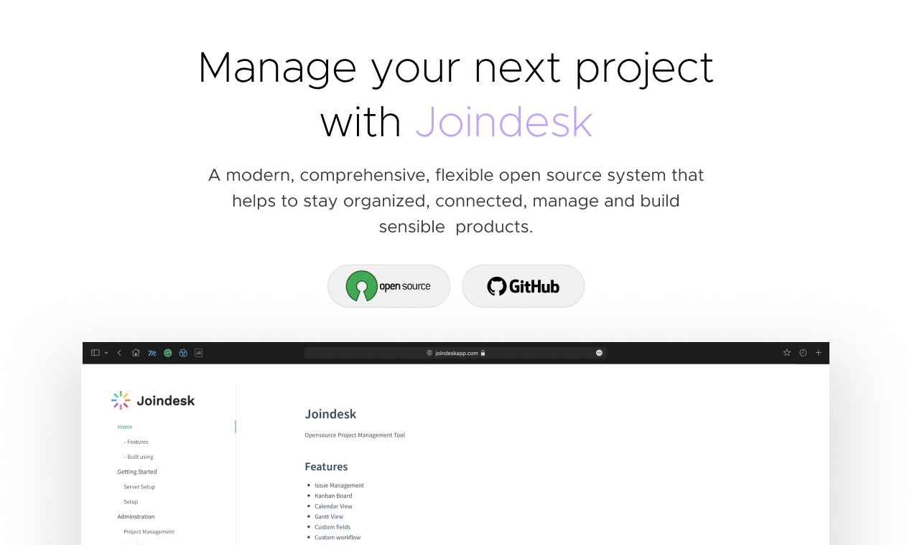
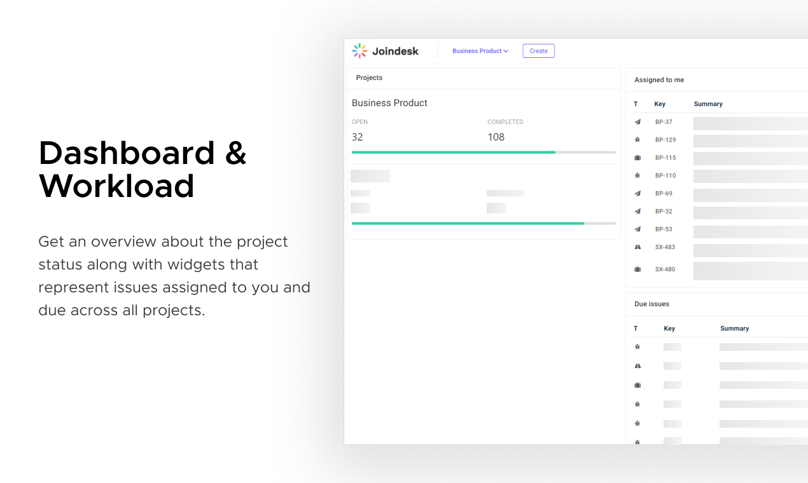
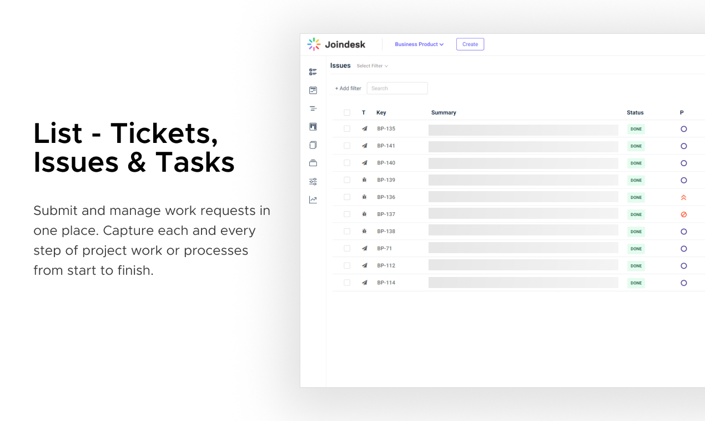
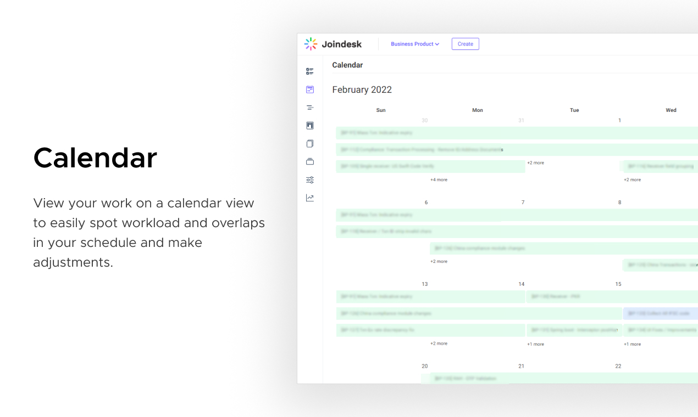
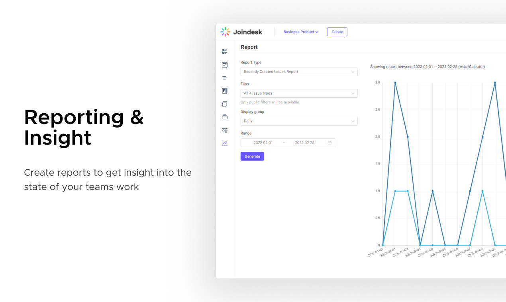
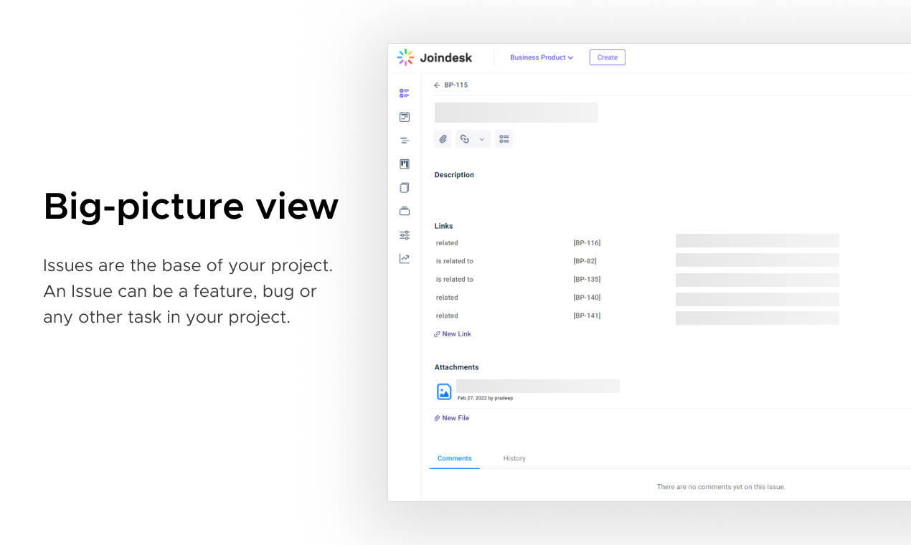

# Joindesk
Opensource Project Management Tool

## Features
* Issue Management
* Kanban Board
* Calendar View
* Gantt View
* Custom fields
* Custom workflow
* Fine grained access control
* Checklist 
* Version / Release Management
* Wiki
* Webhooks
* Firewall

This tool is inspired and built as an alternative to JIRA, Confluence and many other similar tools. 
This is a side project built to learn and try out different features and technologies.

## Built using 
- Spring boot 2.4 (Java 11)
- Angular 8 (Bootstrap 4, Ant 8.5)
- Postgres 12

