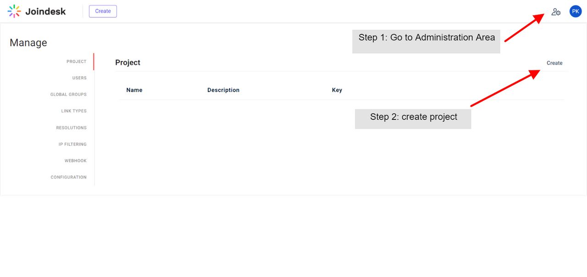
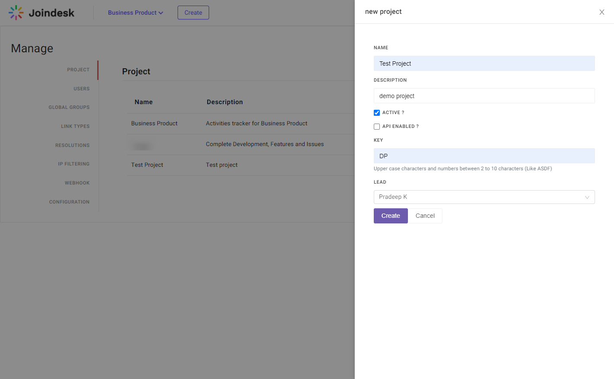
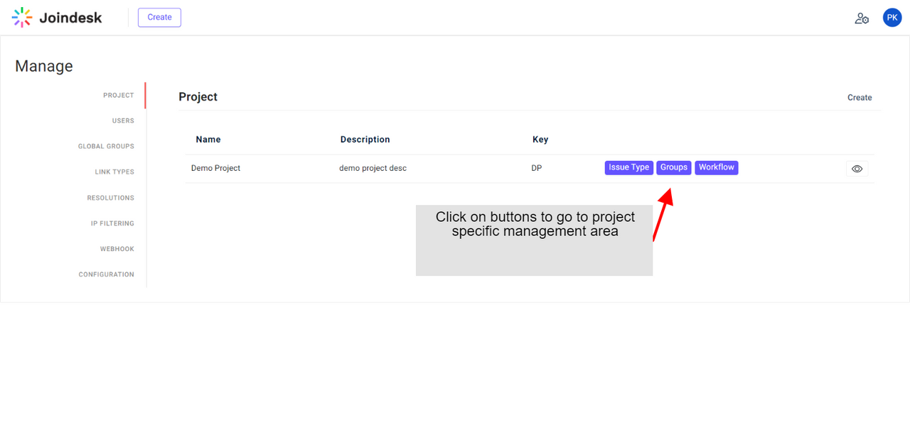
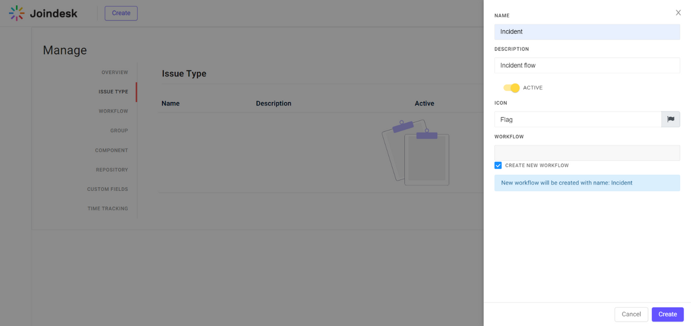
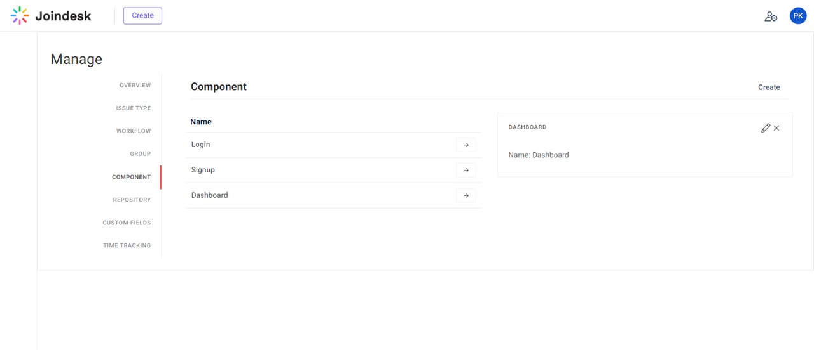
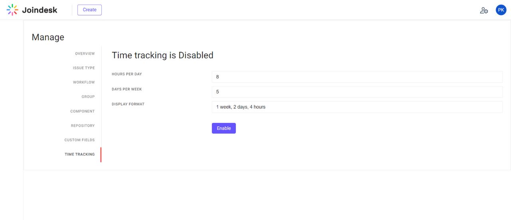

# Project Management

## Create Project
Go to Administration area and create new project

Provide required details in the drawer

!> Project Key cannot be changed later

## Project list

After project is created the details can be viewed as below.

Use the buttons to navigate to drill down to project level management

## Manage Issue Type
Each project can have different types of issues (example: incident / task / bug etc.)

Use them to differentiate between issues from a project.

## Manage Components
Group issues by components / modules

## Time tracking
Disabled by default, Log and track time per issue level

After enabled estimate and actual work time can be logged against each issue

## Custom Fields
Create custom field of different types and options. Also configure its display conditionally based on issue type.

### Field Types
- Text
- Number
- Select (Single / Multiple select)
- Date
- User
- Version

Choose default values for fields and help text which will be displayed as input field hint.